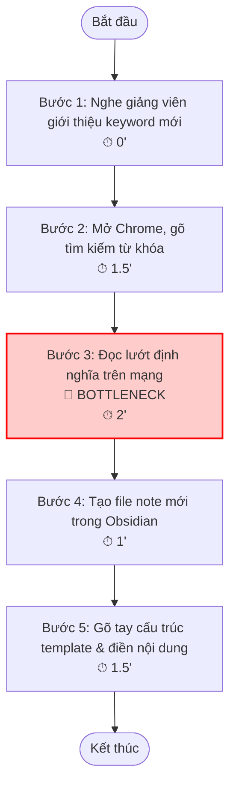
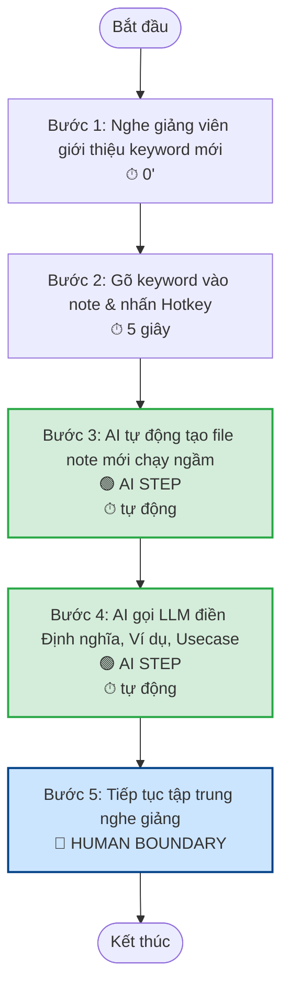
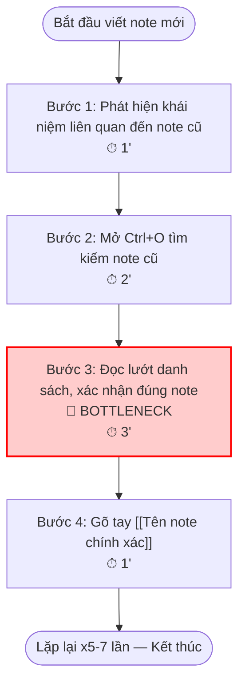
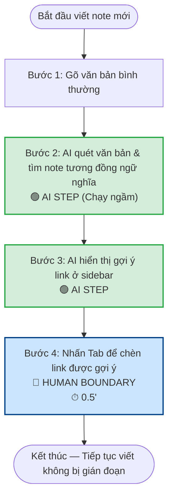
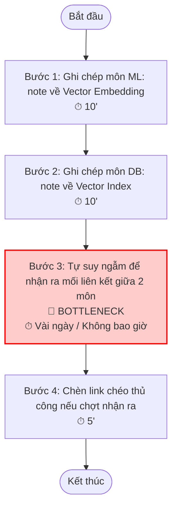
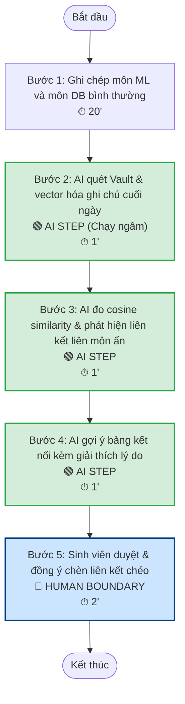
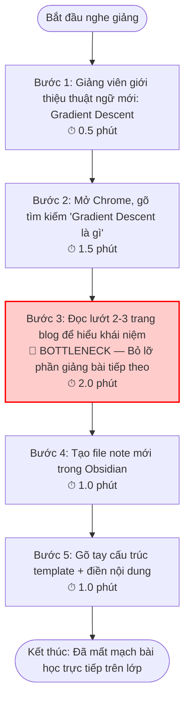
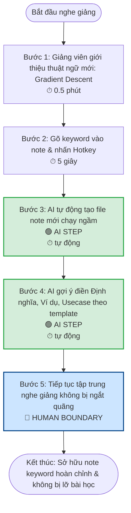

# 01 — Individual Problem Scan & Idea Development

**MSHV:** 2A202600636

---

## 1. Bảng Quét Rộng 9 Problems

- Dưới đây là bảng quét 9 problems 

| #   | Lăng kính         | Problem quan sát được                                                                                                                                                     | Ai đang đau?                               | Dấu hiệu thật                                                                                                                                                              |
| --- | ----------------- | ------------------------------------------------------------------------------------------------------------------------------------------------------------------------- | ------------------------------------------ | -------------------------------------------------------------------------------------------------------------------------------------------------------------------------- |
| 1   | Lặp lại           | Phải dừng lại tra cứu keyword mới khi đang nghe giảng, làm gián đoạn và mất nhịp tiếp thu bài học trực tiếp trên lớp.                                                     | Sinh viên đại học (VinUni, FPT,...)        | Một keyword mới mất 30–90 giây thao tác mở trình duyệt, tìm định nghĩa và tạo note keyword rời rạc.                                                                        |
| 2   | Lặp lại           | Chèn liên kết nội bộ (internal link) giữa các ghi chú trong Obsidian cực kỳ thủ công và dễ bỏ sót.                                                                        | Sinh viên, người xây dựng Second Brain     | Gặp khái niệm cũ nhưng không nhớ rõ tên file chính xác, phải mở thanh tìm kiếm tìm lại rồi gõ tay tên note liên tục, gây context switching.                                |
| 3   | Lặp lại           | Mỗi lần tạo ghi chú thuật ngữ mới đều phải gõ lại cấu trúc định dạng giống nhau hoàn toàn thủ công.                                                                       | Sinh viên ghi chép bài học                 | Lặp đi lặp lại một mẫu ghi chú (định nghĩa, ví dụ minh họa, use case, related concepts), tốn 3-5 phút viết lại khung cho mỗi note.                                         |
| 4   | AI làm tốt hơn    | Khó phát hiện và liên kết các kiến thức tương đồng nhưng khác tên gọi giữa nhiều môn học khác nhau (phân mảnh kiến thức).                                                 | Sinh viên ngành Khoa học Máy tính, AI      | Kiến thức bị đóng hộp (siloed) theo thư mục môn học, ví dụ môn ML gọi là "embedding", môn Database gọi là "vector index" nhưng sinh viên không nhận ra chúng liên hệ nhau. |
| 5   | Tốn thời gian     | Phải tách lọc thủ công các định nghĩa cốt lõi, công thức, code mẫu từ slide bài giảng PDF của giảng viên vào Obsidian.                                                    | Sinh viên trước buổi học hoặc trước kỳ thi | Mở song song slide PDF và Obsidian, copy-paste và format lại markdown thủ công, tốn 30–45 phút cho mỗi slide bài giảng dài.                                                |
| 6   | Lặp lại           | Tạo Flashcards ôn tập (Spaced Repetition / Anki) từ ghi chú bài giảng trong Obsidian cực kỳ tốn công sức và dễ nản lòng.                                                  | Sinh viên chuẩn bị ôn thi cuối kỳ          | Đọc lại ghi chú đã ghi, tự nghĩ câu hỏi/câu trả lời rồi copy sang hệ thống Anki thủ công, tốn 30 phút cho mỗi bài học lớn.                                                 |
| 7   | AI có thể tốt hơn | Khi cần tìm lại code mẫu hoặc giải pháp cho một dạng lỗi đã gặp trước đó, phải mất công tìm kiếm trong lịch sử chat Discord hoặc file notebook rải rác.                   | Sinh viên thực tập AI                      | Hỏi lại mentor same câu 2–3 lần/tháng; mentor mất thêm 10–15 phút giải thích lại context đã có sẵn.                                                                        |
| 8   | Tốn thời gian     | Tổng hợp báo cáo thực tập định kỳ (tuần/tháng) — phải mở nhiều nguồn (Notion, Discord, Google Sheets, tài liệu kỹ thuật) để lấy dữ liệu vào một template báo cáo cố định. | Sinh viên thực tập                         | ~45 phút/lần, 4 lần/tháng; dễ bị sót số liệu hoặc phải làm lại template nếu thay đổi format.                                                                               |
| 9   | Lặp lại           | Sinh viên mới vào CLB/nhóm dự án phải hỏi lại cùng các câu onboarding (tool dùng gì, quy trình nộp bài thế nào, liên hệ ai) vì không có tài liệu rõ ràng.                 | Thành viên mới, người phụ trách onboarding | Mỗi kỳ tuyển thành viên mới lại xuất hiện ~10–15 câu hỏi giống nhau trong chat nhóm.                                                                                       |

---

## 2. Top 3 Problem Cards

| Rank | Problem | Vì sao chọn | Điều còn chưa chắc |
|---|---|---|---|
| 1 | Tạo note keyword & điền định nghĩa tự động (Auto-Keyword Template) | Tiết kiệm thời gian nghe giảng trực tiếp rõ rệt; workflow rõ ràng và dễ đo lường thành công. | Chất lượng định nghĩa của LLM có bám sát slide/giáo trình của giảng viên hay chỉ định nghĩa chung chung. |
| 2 | Chèn internal link tự động (Semantic Auto-Linker) | Pain cực lớn, xảy ra hàng ngày; AI giải quyết bài toán so khớp ngữ nghĩa vượt trội hơn hẳn rule-based. | Scalability khi vault có hàng ngàn file; độ trễ khi phân tích real-time. |
| 3 | Bản đồ liên kết kiến thức liên môn (Cross-Subject Knowledge Mapper) | Giải quyết triệt để pain phân mảnh kiến thức; mang lại giá trị gia tăng lớn cho Knowledge Graph. | Cách visualize sơ đồ gợi ý liên môn sao cho dễ hiểu, tránh information overload. |

---

## Problem Card #1 — Tạo note keyword & điền định nghĩa tự động

```
Problem 1 câu:
Sinh viên vừa nghe giảng vừa phải dừng lại để tra cứu từ khóa mới và thiết kế
ghi chú chi tiết theo template từ đầu, làm mất nhịp nghe giảng và tiếp thu
kiến thức trực tiếp trên lớp.

Actor:
Sinh viên đại học trong các buổi nghe giảng lý thuyết
(ví dụ môn Computer Science, AI, Business tại VinUni).

Thời điểm / bối cảnh:
Khi giảng viên giới thiệu một thuật ngữ/thuật toán mới
(ví dụ: "Gradient Descent" hoặc "Loss Function") trong lúc đang nghe giảng trực tiếp.

Current workflow 3-7 bước:
1. Nghe giảng viên nói hoặc slide chiếu về một keyword mới.
2. Mở trình duyệt, vào Google/Wikipedia gõ tìm kiếm từ khóa đó để hiểu sâu hơn.
3. Đọc lướt định nghĩa, ví dụ trên mạng.
4. Tạo một file note mới trong Obsidian cho keyword đó.
5. Tự tay gõ cấu trúc ghi chú (định nghĩa, công thức toán học, use case, related concepts).
6. Copy-paste thông tin đã tra cứu vào đúng các mục trong template đó.

Bottleneck:
Bước 2, 3 & 5 — Mở tab tra cứu ngoài và soạn thảo cấu trúc ghi chú thủ công
tốn 3-5 phút mỗi keyword, làm sinh viên bị mất hoàn toàn nhịp nghe giảng trực tiếp.

Impact:
- Bỏ lỡ phần giảng giải tiếp theo vì đang mải tra cứu và soạn note.
- Ghi chép bị đứt gãy, dở dang hoặc hời hợt chỉ để kịp tiến độ bài học.
- Note keyword thiếu tính hệ thống và không đồng nhất định dạng giữa các môn.

Success metric:
Giảm thời gian tạo và điền thông tin đầy đủ cho một note keyword
từ 5 phút xuống còn dưới 10 giây.
Sinh viên giữ vững nhịp nghe giảng 100% không bị ngắt quãng.
Toàn bộ note keyword đồng nhất cấu trúc chuẩn.

Non-AI alternative:
Dùng tính năng Core Templates của Obsidian để chèn khung ghi chú trống,
nhưng sinh viên vẫn phải tự tìm kiếm nội dung và điền thủ công vào khung đó.

AI hypothesis:
Một plugin Obsidian tích hợp LLM (như OpenAI GPT-4o-mini hoặc Claude 3.5 Haiku).
Sinh viên chỉ cần bôi đen keyword trong note bài giảng và nhấn một phím tắt (Hotkey).
Plugin tự động tạo file note mới mang tên keyword đó, đồng thời gọi API LLM
điền đầy đủ thông tin theo template ở chế độ chạy ngầm (asynchronous background task).

Quick gut:
[x] Workflow (Bôi đen keyword → Gọi LLM điền nội dung → Tạo note mới theo template)
[ ] Agent
[ ] Rule
[ ] No AI / process fix
[ ] Chưa biết
```

### Draft current workflow



### Draft future workflow



> [!NOTE]
> **Fallback:** Nếu AI điền nội dung chưa chính xác, sinh viên tự sửa đổi khi ôn tập lại bài học vào cuối ngày, không làm gián đoạn buổi học.

---

## Problem Card #2 — Chèn internal link tự động (Semantic Auto-Linker)

```
Problem 1 câu:
Sinh viên sử dụng Obsidian mất nhiều thời gian tìm kiếm thủ công và liên kết
ghi chú cũ với ghi chú mới bằng cú pháp [[note]], dẫn đến các ghi chú bị cô lập
(orphan notes) và mất đi sức mạnh kết nối của đồ thị kiến thức.

Actor:
Sinh viên đại học ghi chép bài học trên Obsidian/Notion,
người xây dựng cơ sở tri thức cá nhân (Second Brain).

Thời điểm / bối cảnh:
Khi đang gõ note bài giảng mới (ví dụ: đang viết note về
"RAG - Retrieval-Augmented Generation" trong môn NLP và muốn liên kết
tới khái niệm "Vector Database" của môn Database học kỳ trước).

Current workflow 3-7 bước:
1. Đang viết note mới, xuất hiện khái niệm liên quan đến kiến thức đã học.
2. Dừng viết, mở thanh tìm kiếm Obsidian (Ctrl + O) để tra cứu xem trước đây
   mình đã tạo note cho khái niệm này chưa, tên note chính xác là gì.
3. Nếu tìm thấy, quay lại note hiện tại và gõ tay liên kết dạng [[Tên note chính xác]].
4. Nếu không tìm thấy hoặc tên note khác đi một chút, phải quyết định viết tiếp
   hoặc tạo note mới rồi link sau.
5. Tiếp tục lặp lại quy trình này cho mỗi khái niệm xuất hiện trong note
   (trung bình 5-7 liên kết mỗi note học tập).

Bottleneck:
Bước 2 & 3 — Việc tra cứu thủ công và nhớ tên chính xác của các note cũ cực kỳ
mất thời gian, gây ngắt mạch suy nghĩ (context switching liên tục,
trung bình mất 1-2 phút cho mỗi link).

Impact:
- Tốn 10-15 phút cho mỗi ghi chú dài chỉ để làm công việc liên kết thủ công.
- Sinh viên ngại liên kết, dẫn đến đồ thị kiến thức bị phân mảnh.
- Xuất hiện nhiều ghi chú mồ côi (orphan notes) không có kết nối.

Success metric:
Giảm thời gian chèn liên kết từ 10-15 phút xuống còn dưới 1 phút mỗi note.
Tỷ lệ ghi chú được liên kết tự động chính xác đạt trên 90%.
Xóa bỏ hoàn toàn tình trạng ghi chú mồ côi (orphan notes).

Non-AI alternative:
Sử dụng tính năng tìm kiếm mặc định của Obsidian hoặc các plugin rule-based
(chỉ tìm kiếm dựa trên từ khóa khớp chính xác 100%, không nhận diện được
đồng nghĩa hay ngữ cảnh ngữ nghĩa như "Vector DB" và "Cơ sở dữ liệu vector").

AI hypothesis:
Một plugin AI chạy nền, tự động quét văn bản đang viết, dùng mô hình Embedding
để so sánh độ tương đồng ngữ nghĩa giữa đoạn văn hiện tại với toàn bộ tiêu đề
và nội dung các note hiện có trong Vault. Plugin hiển thị danh sách gợi ý liên kết
thông minh ở sidebar, sinh viên chỉ cần nhấn Tab hoặc click để chèn link.

Quick gut:
[x] Workflow (AI hỗ trợ quét, tìm kiếm ngữ nghĩa và gợi ý link thông minh)
[ ] Agent
[ ] Rule
[ ] No AI / process fix
[ ] Chưa biết
```

### Draft current workflow



### Draft future workflow



> [!NOTE]
> **Fallback:** Nếu AI gợi ý sai, sinh viên chèn link thủ công bằng cú pháp [[]] mặc định của Obsidian.

---

## Problem Card #3 — Bản đồ liên kết kiến thức liên môn (Cross-Subject Knowledge Mapper)

```
Problem 1 câu:
Sinh viên gặp khó khăn trong việc kết nối các kiến thức tương đồng nhưng khác
tên gọi giữa các môn học khác nhau, khiến kiến thức bị phân mảnh và rời rạc.

Actor:
Sinh viên ngành Trí tuệ nhân tạo, Khoa học máy tính
học nhiều môn chuyên ngành song song.

Thời điểm / bối cảnh:
Khi ôn tập cuối kỳ hoặc làm dự án nghiên cứu liên ngành cần xâu chuỗi
kiến thức từ tất cả các môn học đã tích lũy trong Vault Obsidian.

Current workflow 3-7 bước:
1. Học môn mới (ví dụ Machine Learning), ghi chép khái niệm "Vector Embedding".
2. Học môn khác (ví dụ Database), ghi chép khái niệm "Vector Index".
3. Khi cần làm bài tập lớn/ôn thi, phải tự suy ngẫm hoặc tình cờ thảo luận
   để nhận ra hai khái niệm này liên quan mật thiết với nhau.
4. Nếu may mắn phát hiện ra sự liên kết, tiến hành chèn link chéo thủ công
   giữa hai ghi chú ở hai thư mục môn học khác nhau.

Bottleneck:
Bước 3 — Tự nhận ra các mối liên kết tiềm ẩn giữa các môn học hoàn toàn
phụ thuộc vào trí nhớ và sự nhạy bén của sinh viên;
không có công cụ nào hỗ trợ kết nối ngữ nghĩa có hệ thống.

Impact:
- Kiến thức bị đóng hộp (siloed) theo từng thư mục môn học riêng biệt.
- Sinh viên không thấy "bức tranh toàn cảnh" (big picture), học vẹt từng môn.
- Lãng phí tài nguyên đồ thị kiến thức khổng lồ của Obsidian.

Success metric:
Tự động gợi ý các liên kết liên môn ẩn với độ chính xác cao
(sinh viên xác nhận có ích > 80%).
Tăng số lượng cross-subject links lên gấp 3 lần trong vòng 1 tháng sử dụng.

Non-AI alternative:
Tổ chức lại cây thư mục thủ công hoặc dùng tag chung (ví dụ #vector, #math),
nhưng đòi hỏi kỷ luật cực cao và không tìm được các liên kết ngữ nghĩa gián tiếp.

AI hypothesis:
Xây dựng pipeline phân tích đồ thị kiến thức ngữ nghĩa (Semantic Graph Analysis).
Plugin biến đổi toàn bộ ghi chú vault thành vector embeddings qua mô hình local
(Transformers.js chạy trên máy để bảo mật data). AI phân tích ghi chú ở các
thư mục môn khác nhau, tìm cặp note có cosine distance nhỏ nhất nhưng chưa
được liên kết, rồi hiển thị bảng gợi ý kèm giải thích lý do liên quan.

Quick gut:
[ ] No AI / process fix
[ ] Rule
[x] Workflow (Quét Vault → Vector hóa → Đo cosine similarity → Đề xuất liên kết liên môn)
[ ] Agent
[ ] Chưa biết
```

### Draft current workflow



### Draft future workflow



> [!NOTE]
> **Fallback:** Nếu AI đề xuất liên kết false positive, sinh viên bấm từ chối gợi ý đó và AI học từ phản hồi này.

---

## 3. Bản Sơ Đồ Quy Trình cho Card muốn Pitch nhất (Card #1: Auto-Keyword Template)

### CURRENT STATE — Tổng thời gian: ~6 phút/keyword (mất nhịp nghe giảng)



---

### FUTURE STATE — Tổng thời gian: ~10 giây/keyword (tập trung nghe giảng 100%)


